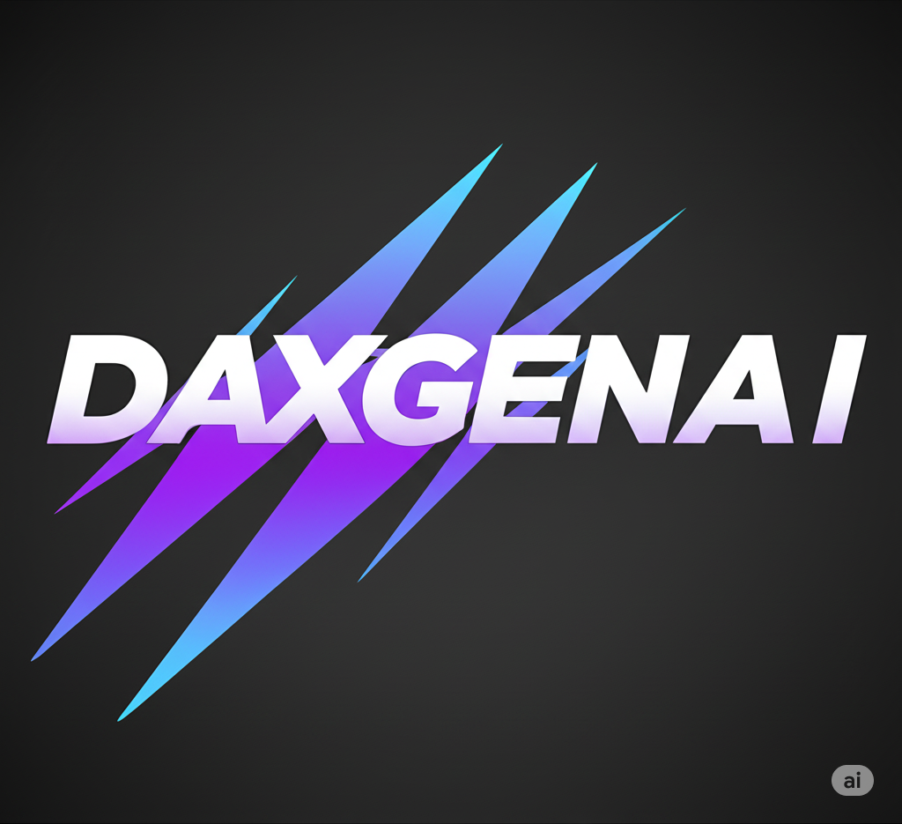

# 🚀 DAxGENAI - Professional Data Analysis Training Platform

A modern, interactive training platform designed to transform careers through personalized Data Analysis and AI education. Built with cutting-edge technologies and featuring a beautiful dark theme inspired by industry leaders.



## ✨ Features

### 🎯 **Core Training Features**
- **Personalized One-on-One Training** with Senior Data Analyst
- **8 Comprehensive Course Modules** from beginner to advanced
- **Interactive Learning Experience** with real-time feedback
- **Career Support & Mentorship** including resume review and mock interviews
- **Flexible Scheduling** across different time zones

### 🎨 **Modern UI/UX**
- **Dark Theme Design** inspired by Deepgram's professional aesthetic
- **Smooth Animations** using Framer Motion
- **Responsive Design** optimized for all devices
- **Interactive Components** with hover effects and transitions
- **Professional Typography** and color schemes

### 🔧 **Technical Excellence**
- **React 18** with TypeScript for type safety
- **Vite** for lightning-fast development and builds
- **Tailwind CSS** for utility-first styling
- **Framer Motion** for smooth animations
- **Firebase Integration** for authentication and data management
- **Demo Booking System** with Google Calendar integration

### 📊 **Course Modules**
1. **Introduction to Data Analysis with Generative AI**
2. **Advanced Excel for Data Analysis**
3. **SQL & Database Management**
4. **Microsoft Power BI**
5. **Python Programming for Data Science**
6. **Statistics for Data Analysis**
7. **Machine Learning Fundamentals**
8. **Generative AI & Its Tools**

## 🛠️ Tech Stack

### **Frontend**
- **React 18** - Modern UI library
- **TypeScript** - Type-safe development
- **Vite** - Fast build tool and dev server
- **Tailwind CSS** - Utility-first CSS framework
- **Framer Motion** - Animation library
- **Lucide React** - Beautiful icons

### **Backend & Services**
- **Node.js** - Server runtime
- **Express.js** - Web framework
- **Firebase** - Authentication & Firestore
- **Google Calendar API** - Demo scheduling
- **Nodemailer** - Email notifications

### **Development Tools**
- **ESLint** - Code linting
- **Prettier** - Code formatting
- **Vitest** - Unit testing
- **Testing Library** - Component testing

## 🚀 Quick Start

### **Prerequisites**
- Node.js (v18 or higher)
- npm or yarn
- Git

### **Installation**

1. **Clone the repository**
   ```bash
   git clone https://github.com/yourusername/daxgenai.git
   cd daxgenai
   ```

2. **Install dependencies**
   ```bash
   npm install
   ```

3. **Set up environment variables**
   ```bash
   cp .env.example .env
   # Edit .env with your configuration
   ```

4. **Start the development server**
   ```bash
   npm run dev
   ```

5. **Open your browser**
   Navigate to `http://localhost:3000`

### **Backend Setup**

1. **Navigate to server directory**
   ```bash
   cd server
   npm install
   ```

2. **Configure environment variables**
   ```bash
   cp .env.example .env
   # Add your Firebase, Gmail, and Google Calendar credentials
   ```

3. **Start the backend server**
   ```bash
   npm start
   ```

## 📁 Project Structure

```
DAxGENAI/
├── src/
│   ├── components/          # React components
│   │   ├── auth/           # Authentication components
│   │   └── ...
│   ├── services/           # API services
│   ├── store/              # State management
│   ├── hooks/              # Custom React hooks
│   ├── pages/              # Page components
│   └── firebase/           # Firebase configuration
├── server/                 # Backend API
│   ├── api/               # API routes
│   └── credentials/       # Service account keys
├── public/                # Static assets
└── docs/                  # Documentation
```

## 🎨 Design System

### **Color Palette**
- **Primary**: Sky Blue (#0ea5e9)
- **Secondary**: Purple (#8b5cf6)
- **Background**: Dark Slate (#0f172a)
- **Surface**: Slate (#1e293b)
- **Text**: Light Slate (#f8fafc)

### **Typography**
- **Headings**: Inter (Bold)
- **Body**: Inter (Regular)
- **Code**: Monaco (Monospace)

## 🔧 Configuration

### **Environment Variables**

Create a `.env` file in the root directory:

```env
# Frontend
VITE_API_URL=http://localhost:5001
VITE_FIREBASE_API_KEY=your_firebase_api_key
VITE_FIREBASE_AUTH_DOMAIN=your_project.firebaseapp.com
VITE_FIREBASE_PROJECT_ID=your_project_id
VITE_FIREBASE_STORAGE_BUCKET=your_project.appspot.com
VITE_FIREBASE_MESSAGING_SENDER_ID=your_sender_id
VITE_FIREBASE_APP_ID=your_app_id

# AI APIs
VITE_GEMINI_API_KEY=your_gemini_api_key
VITE_OPENAI_API_KEY=your_openai_api_key

# Analytics
VITE_GA_MEASUREMENT_ID=your_ga_id
```

### **Backend Environment Variables**

Create a `.env` file in the `server/` directory:

```env
# Server Configuration
PORT=5001
NODE_ENV=development

# Firebase Admin
FIREBASE_PROJECT_ID=your_project_id
GOOGLE_APPLICATION_CREDENTIALS=./credentials/service-account-key.json

# Gmail Configuration
EMAIL_USER=your_email@gmail.com
EMAIL_PASS=your_app_password

# Admin Email
ADMIN_EMAIL=your_email@gmail.com

# Google Calendar
GOOGLE_CALENDAR_ID=primary
```

## 🧪 Testing

```bash
# Run unit tests
npm test

# Run tests in watch mode
npm run test:watch

# Run tests with coverage
npm run test:coverage
```

## 📦 Build & Deployment

### **Development**
```bash
npm run dev
```

### **Production Build**
```bash
npm run build
```

### **Preview Production Build**
```bash
npm run preview
```

## 🌟 Key Features in Detail

### **Interactive Hero Section**
- Dynamic testimonials with auto-rotation
- Floating achievement badges
- Smooth scroll animations
- Video play overlay

### **Enhanced Course Catalog**
- Beautiful 3D course cards
- Staggered animations on scroll
- Responsive grid layout
- Interactive hover effects

### **Smart Testimonials Carousel**
- Auto-playing with manual controls
- Progress indicators
- Smooth transitions
- Mobile-responsive design

### **Interactive FAQ System**
- Search functionality
- Category filtering
- Smooth accordion animations
- No results handling

### **Professional Contact Form**
- Dark theme styling
- Form validation
- Success/error handling
- Demo booking integration

## 🤝 Contributing

1. Fork the repository
2. Create a feature branch (`git checkout -b feature/amazing-feature`)
3. Commit your changes (`git commit -m 'Add amazing feature'`)
4. Push to the branch (`git push origin feature/amazing-feature`)
5. Open a Pull Request

## 📄 License

This project is licensed under the MIT License - see the [LICENSE](LICENSE) file for details.

## 🆘 Support

- **Email**: support@daxgenai.com
- **Phone**: +1 (555) 123-4567
- **Documentation**: [Project Documentation](PROJECT_DOCUMENTATION.md)
- **Setup Guide**: [Setup Guide](SETUP_GUIDE.md)

## 🎯 Roadmap

- [ ] **Advanced Analytics Dashboard**
- [ ] **Mobile App Development**
- [ ] **AI-Powered Learning Paths**
- [ ] **Corporate Training Modules**
- [ ] **Multi-language Support**
- [ ] **Advanced Assessment System**

## 🙏 Acknowledgments

- **Design Inspiration**: Deepgram's professional aesthetic
- **Icons**: Lucide React for beautiful icons
- **Animations**: Framer Motion for smooth interactions
- **Styling**: Tailwind CSS for utility-first design

---

**Built with ❤️ for transforming careers through data analysis education**

*DAxGENAI - Where Data Dreams Become Reality* 